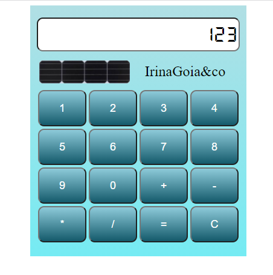

# Calculator-JS-HTML-CSS
simple calculator application (JS, HTML, CSS)

Im Moment mache ich die Ausbildung zum Softwareentwickler. 
Dies ist mein erster funktionierender Javascript-Code nach "Hallo Welt"

